# ManusCrypt
Based on Malware Bazaar this [sample](https://bazaar.abuse.ch/sample/c07e74c3367d7fada8618f94d8c73122f161ffe79eb4534bde78f57998b54813/) is ManusCrypt.
The first part seems to be a dropper, overall the sample downloads two files and unpacks those in a multi step process.
Based on the supplied sample this was downloaded from vk[.]com.
The information regarding ManusCrypt seems limited, so it is hard to tell if this sample might really be ManusCrypt.

- First stage: Uses com objects to download and execute files
- Second stage: Simple obfuscated strings to load functions and load shellcode from a previous file into memory
- Third stage: XOR decrypt some memory and load functions via hashes. Load other data into memory an rebuilds it as a PE file.
- Final stage: A trojan.

The urls might still be working, as nearly three weeks after the upload of the sample, the first stage downloads were still available.

Links to malshare for all files can be found at the end of this document.

Potential future updates, more about the last stage, figuring out how exactly the loading from stage 3 to the last works and how exactly is the data extracted from the .html and .png file. 

## First file (c07e74c3367d7fada8618f94d8c73122f161ffe79eb4534bde78f57998b54813)

This file tries to run itself as admin after which it downloads two files via COM objects. Those files are stored in the users %temp% folder and executes the second stage dll via a COM object / WMI.

| Url  | Downloaded file | hash + link |
| ------------- | ------------- | --|
| hxxps://xv[.]yxzgamen[.]com/29.html  | db.dat  | ba07f9487a10ed278772d9571d6e867f53338029a3c4580eed2e08d8f5a8f9bd | 
| hxxps://xv[.]yxzgamen[.]com/logo.png  | db.dll  | ec01d244074f45d4f698f5713147e99d76053824a648b306e1debf69f3ba9ce6 |

When downloading the png directly via a browser it will show as a valid png with the hash 13830185971b7e87231ba8b5e489c9b90bb67a3a59665af7ac47963a1a29afa2.
This png looks like the Google logo: 

Details

The executable checks that it was started with a parameter, if it was not started with one, it runs:
   ShellExecuteExW() of itself with the parameter -h and the verb "runas" to run the application as administrator.
   
   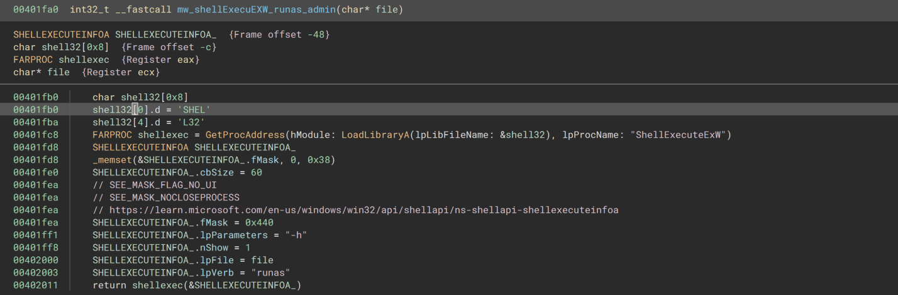

After this the download url strings are setup and a com object is created. Based on a [gist](https://gist.github.com/olafhartong/980e9cd51925ff06a5a3fdfb24fb96c2) by Olaf Hartong this is a com object for http requests.
- {2087c2f4-2cef-4953-a8ab-66779b670495},CLSID WinHttpRequest Component version 5.1
- {016FE2EC-B2C8-45F8-B23B-39E53A75396B},IID IWinHttpRequest

Via the function sub_0x401260, the files are downloaded into the users temp folder, while doing this a dll is extracted out of the png file. (Having a look how this is exactly done is maybe for a future update).
   
   Next the function sub_0x4016d0 is called, inside that function a second com object is created.
  - {4590F811-1D3A-11D0-891F-00AA004B2E24},CLSID WBEM Locator
  - dc12a687-737f-11cf-884d-00aa004b2e24 IID_IWbemLocator [found in an article from OALABS](https://research.openanalysis.net/hermetic/hermetic%20wizard/spreader/malware/apt/2022/03/10/hermetic_wizard.html)

   
   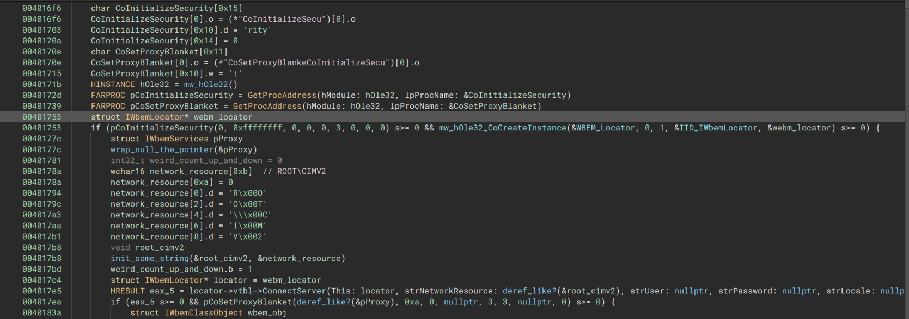
   
   The technique seems similar to what is described at https://evasions.checkpoint.com/techniques/wmi.html#escape-from-tracking and in the end executes:
  - rundll32.exe "db.dll",open
   

## Second stage (ec01d244074f45d4f698f5713147e99d76053824a648b306e1debf69f3ba9ce6)
This stage is started by calling the export "open", this export and other exports lead to the main function. The dll will resolve some function calls and use those to allocate memory into which it decrypts part of the db.dat file from the previous stage. The shellcode in that memory section is used as the next stage. The shellcode that has been dumped from x64dbg is described in the next section.

Details

First the path of the current dll is loaded and the file extension is change from dll to dat. Afterwards some memory is allocated into which the shellcode will be decoded. To do this pointers to HeapAlloc and HeapCreate are resolved via the function at 0x10007400.
   
The previously allocated memory is passed to  the function at 0x100074f0  (int32_t mw_read_into_shellcode(char* `shellcode?`, int32_t* arg2, char* fileName)). In this function more functions will be resolved, this time the strings are slightly protected.
   In this function the referenced strings are obfuscated by using different values that are added or subtracted from them as in the following example. The string CreateFileW is created by using 4 DWORDS and subtracting 0x21435622 from each of them.
   
   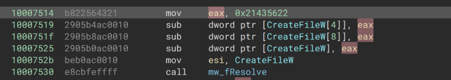
   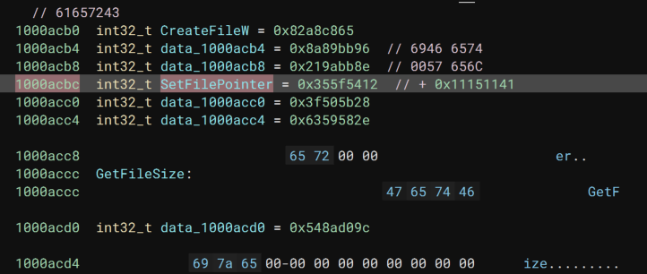
   
   Like this multiple function names are decoded and their pointers are resolved. Here is part of the function shown at a decompiler level.
   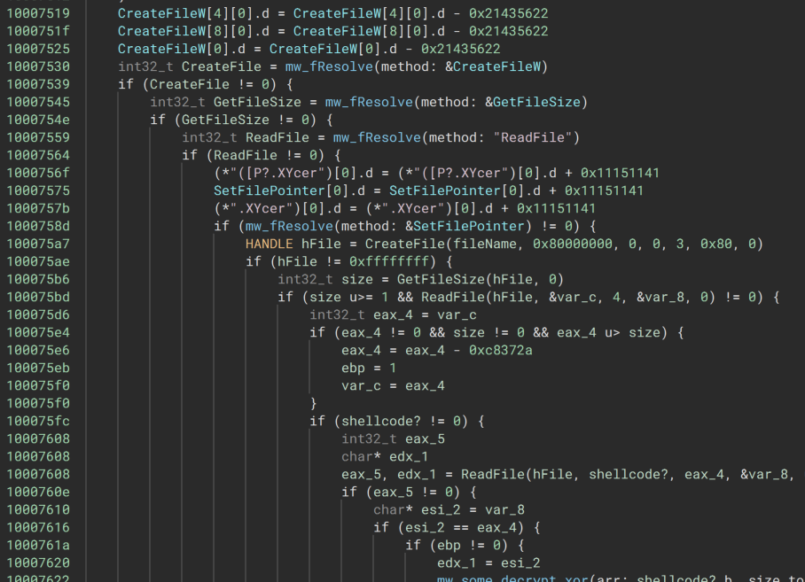
   
   After resolving the functions, the size of the data will be read from the db.dat file, the data is then loaded into the shellcode memory area.
   
   The data is also decrypted during this process, this is something that I might look into closer at a later point, during this look at the sample, the final memory region was dumped and further analyzed in Binary Ninja.
   
   Once this function is done the shellcode will be called and continue as the next stage.
   

## Third stage (72ab1eb5b342cada2c10e0005687cbbe5a0d7a58e6c772bc6e758d2899123a49)
This is a shellcode that is extracted from the html/dat file downloaded in stage 1 and is loaded into memory during the previous stage. This code extracts data from the process to load the final payload into memory. 
To do this it first decrypts part of the data with a simple xor key and afterwards resolved some hashed APIs to decompress more data. Finally that decompressed data is fixed into a PE file and imports for it are resolved. The final PE file is linked in the next section.

Details

The entrypoint for this memory region is 0x20 bytes into it. At this point the code gets it own address via reading a return address. From this address it adds an offset to some compressed data. The compressed data is prepended with the size of the data. 
   
   All the addresses in here are with base 0x5025000 via a file dumped from x64dbg.
   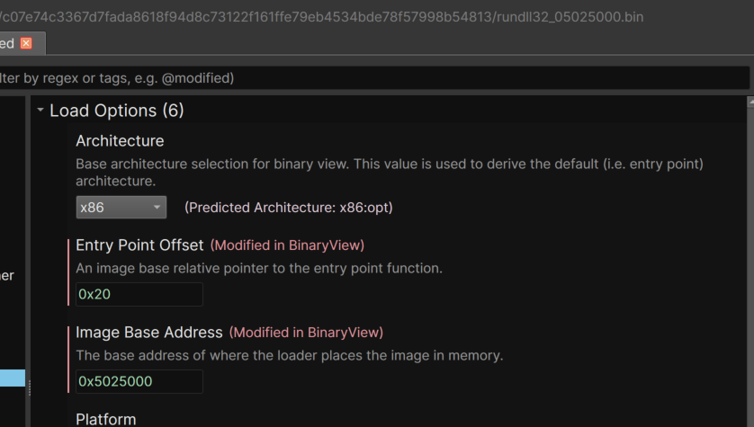   
   
   Data layout for decryption / decompression:
| memory section start + 0x88c |
| ------------- |
| 4 byte size of encrypted area (starting after this DWORD)|
| 4 bytes decompressed memory size (encrypted) | 
| buffer of size: encrypted aread - 4 bytes , this is later decompressed|

   The above offsets are used the decrypt a section of the memory section with the xor key 0x58.
   
   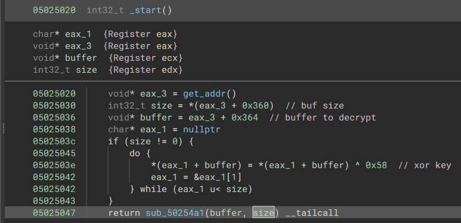
   
   Data at the offset in the file. (The next few screenshots are with a base address of 0x0.
   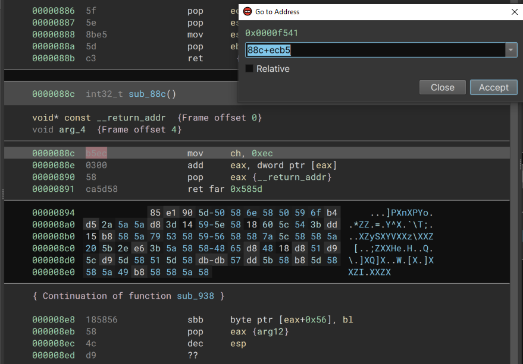
   
   
 That data can be decrypted with the transformation function build into binja.
   
   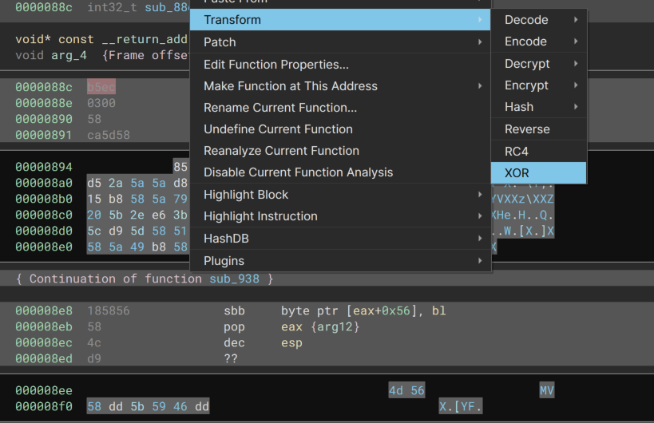
   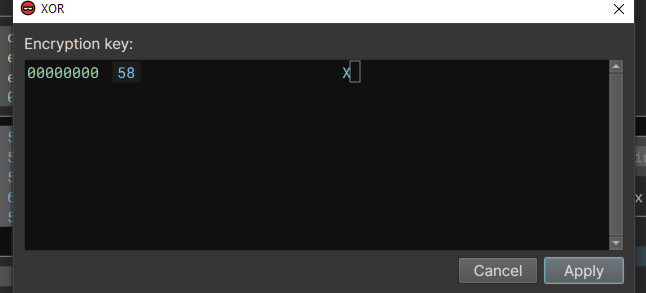
   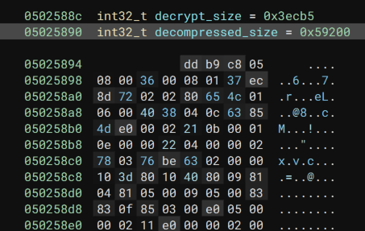
   
   
  Afterwards the function at 0x50252d8 resolves some API hashes, with what looks like the Metasploit ror13 algorithm:
   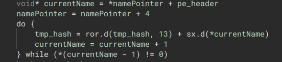
   
   To resolve these functions the Binary Ninja [hashdb](https://hashdb.openanalysis.net/) plugin [from cxiao was used](https://github.com/cxiao/hashdb_bn).
   
   A few screenshots of using hashdb in one of the functions.
   
   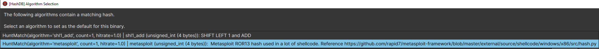
   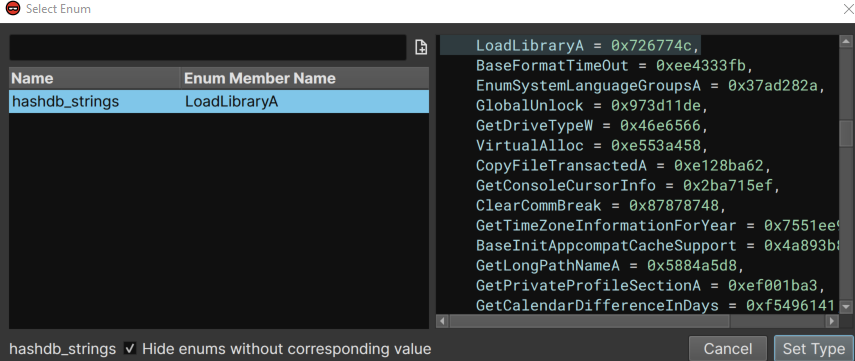
   
After the first functions were resolved the previously decrypted data is decompressed and what looks like a function to fix a PE file in memory is called:
   
   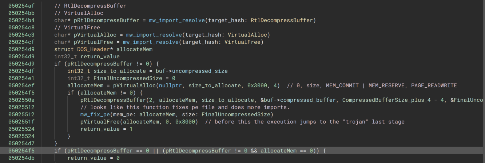
   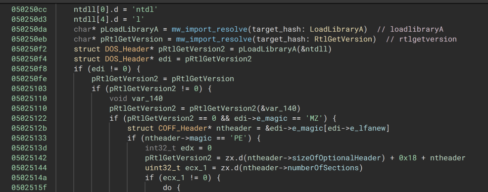
   

   
   This is my first time seeing the loading like this, I have to spend some more time to look into it and can maybe add more details later.
   At this point setting a breakpoint on RtlGetVersion kind of works. Clicking "run to usercode" after it is hit ends up inside the pe that was loaded into memory, so that is not ideal.
   

## Final malware (9e4635cd52e27b5010d0562f17a25639628203fca8c887081c284828fac7cbce)

This final stage looks like a proper trojan and I need to take a better look later on, it seems to have standard functionality like, copying from clipboard, network communication, audio functionality, etc. Not much time was spend on this and maybe I can add more data later on.

Details

After dumping the memory section from the previous stage, it was fixed in PE-Bear.
       
   
   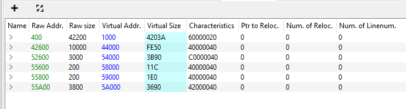
   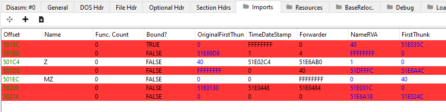
   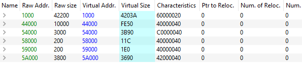
   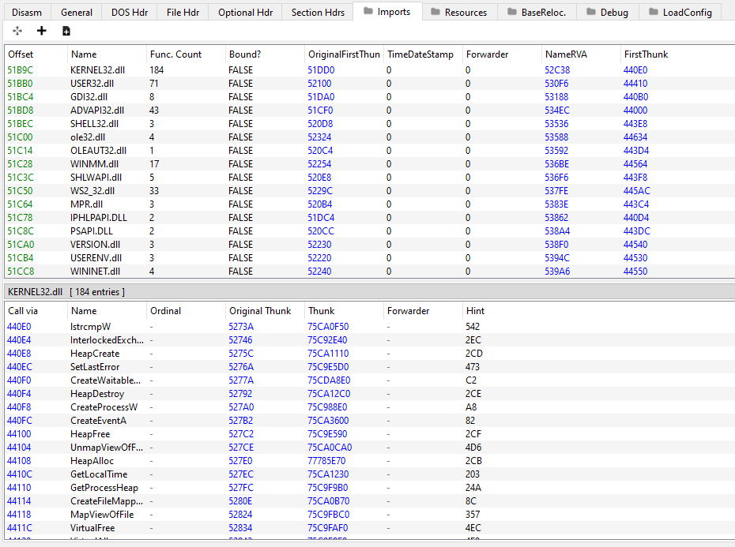
   
   Looking at the strings there were two domains, one of which was also contacted in the VM-Ray report that is linked in the original Malware Bazaar link.
   
| Domains found in strings |
| ------------- |
| g.agametog[.]com  |
| h.agametoh[.]com  |
   

# IOCs  

| Urls / Domains  |
| ------------- |
| hxxps://xv[.]yxzgamen[.]com/29.html  |
| hxxps://xv[.]yxzgamen[.]com/logo.png |
| g.agametog[.]com  |
| h.agametoh[.]com  |

|Filename| SHA256 Hashes  |
|-------------| ------------- | 
|  Original exe |  [c07e74c3367d7fada8618f94d8c73122f161ffe79eb4534bde78f57998b54813](https://malshare.com/sample.php?action=detail&hash=c07e74c3367d7fada8618f94d8c73122f161ffe79eb4534bde78f57998b54813) | 
|  Second stage dll (extracted from png)  | [ec01d244074f45d4f698f5713147e99d76053824a648b306e1debf69f3ba9ce6](https://malshare.com/sample.php?action=detail&hash=ec01d244074f45d4f698f5713147e99d76053824a648b306e1debf69f3ba9ce6) | 
|  Second stage dat / html | [ba07f9487a10ed278772d9571d6e867f53338029a3c4580eed2e08d8f5a8f9bd](https://malshare.com/sample.php?action=detail&hash=ba07f9487a10ed278772d9571d6e867f53338029a3c4580eed2e08d8f5a8f9bd)  | 
|  Second stage png (only used to extract the dll in memory)  | [13830185971b7e87231ba8b5e489c9b90bb67a3a59665af7ac47963a1a29afa2](https://malshare.com/sample.php?action=detail&hash=13830185971b7e87231ba8b5e489c9b90bb67a3a59665af7ac47963a1a29afa2) | 
|  Third stage (memory dump) | [72ab1eb5b342cada2c10e0005687cbbe5a0d7a58e6c772bc6e758d2899123a49](https://malshare.com/sample.php?action=detail&hash=72ab1eb5b342cada2c10e0005687cbbe5a0d7a58e6c772bc6e758d2899123a49)  | 
| Last Stage / Trojan dumped from memory | [9e4635cd52e27b5010d0562f17a25639628203fca8c887081c284828fac7cbce](https://malshare.com/sample.php?action=detail&hash=9e4635cd52e27b5010d0562f17a25639628203fca8c887081c284828fac7cbce)  | 

